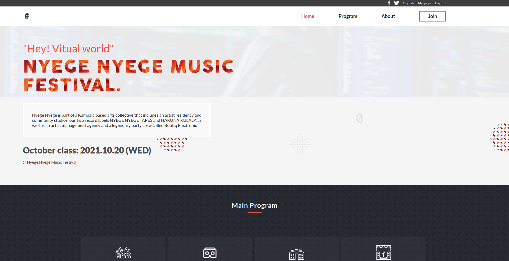

# Capstone project

> Working on a capstone project on week 5 at Microverse bootcamp..

Music fesitival app.

## Built With

- HTML
- CSS
- Java script

## Live Demo

[Live Demo Link](https://obote.github.io/Capstone/)

[Video Link](https://www.loom.com/share/371b770c9a7c4b5fae3141c274ba4c25)

## Getting Started

**This is an example of how you may give instructions on setting up your project locally.**
**Modify this file to match your project, remove sections that don't apply. For example: delete the testing section if the currect project doesn't require testing.**

To get a local copy up and running follow these simple example steps.

### Install

git clone

## Authors

👤 **Denis Obote**

- GitHub: [@Obote](https://github.com/Obote)
- Twitter: [@Obote_denis](https://twitter.com/Obote_denis)
- LinkedIn: [Obote Denis](https://www.linkedin.com/in/obote-denis-9859a2a3/)

## 🤝 Contributing

Contributions, issues, and feature requests are welcome!

Feel free to check the [issues page](../../issues/).

## Show your support

Give a ⭐️ if you like this project!

## Acknowledgments

- Acknowlegdement to Cindy Shin for providing the design

## 📝 License

This project is [MIT](./MIT.md) licensed.
